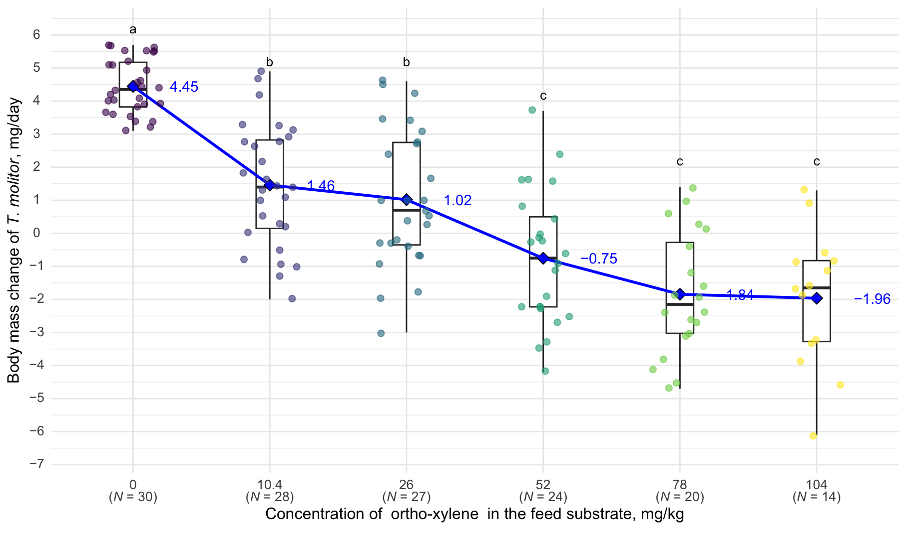
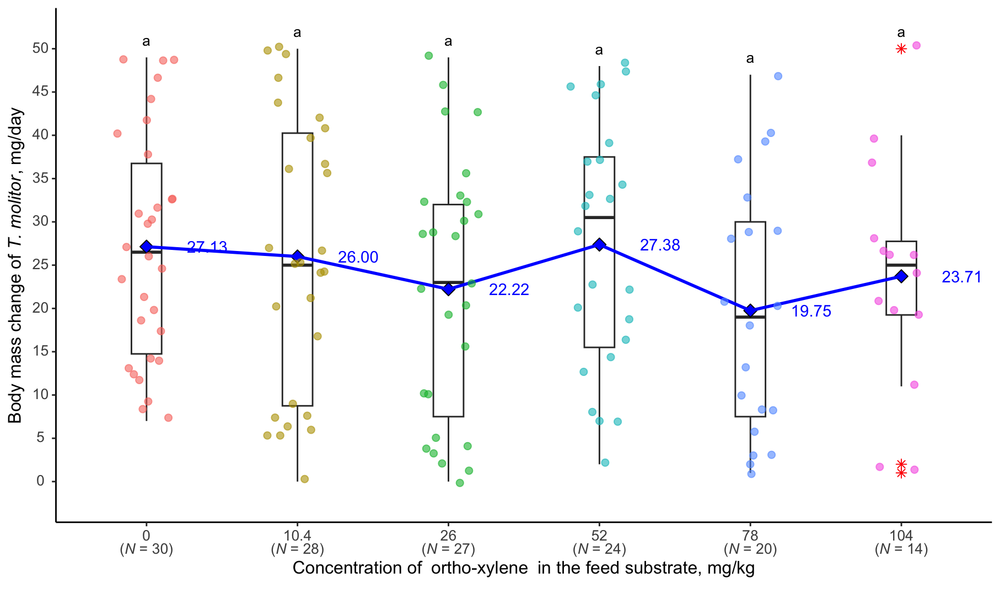

# Effects of toxic organic compounds on Tenebrio molitor and its parasite Gregarina steini

## Abstract

Environmental pollution by toxic compounds affects various species of living organisms, their life cycles and symbiotic relationships. This study investigated the host-parasite relationship between Tenebrio molitor Linnaeus, 1758 (Coleoptera, Tenebrionidae) and Gregarina steini Berthold, 1827 (Eugregarinorida, Gregarinida) under exposure to o-xylene, formaldehyde and aniline at different concentrations. For laboratory studies, 480 larvae of T. molitor and five concentrations of the studied organic compounds were used. Groups of T. molitor, each consisting of ten individuals, were subjected to the tested compounds for 10 days following the initial weight measurement. We measured the body weight and survival rate of T. molitor and the number of G. steini in them to assess the impact of the tested organic compounds on the host-parasite relationship. For all the compounds studied, a decrease in body weight and high mortality were observed in T. molitor at high concentrations. The lethality of the studied organic compounds was concentration-dependent. o-Xylene showed low toxicity at lower concentrations (10.4 and 26.0 mg/kg of feed), with a survival rate of 93.3% and 86.7%, respectively. At a concentration of 10.4 mg/kg, no lethal cases in T. molitor were observed. At higher concentrations (78 and 104 mg/kg feed), T. molitor mortality significantly increased to 33.3% and 53.3%, respectively.

### Material and methods

The following repository contains all data and metadata for conductiong the next analyses:

We conducted all statistical analyses using R version 4.4.2 (R Core Team, 2024) in
RStudio version 2024.12.0+467. We used the following R packages: dplyr (version
1.1.4), ggplot2 (version 3.5.1), and multcompView (version 0.1-10) for post hoc statistical
analysis. We performed one-way analysis of variance (ANOVA) and Tukey’s HSD test to
identify pairwise differences between pollutant concentrations, G. steini abundance, and
changes in T. molitor body mass. We considered differences statistically significant at P
&lt; 0.05.

### Results

Figure 1. Correlation between T. molitor body weight and o-xylene concentration: black horizontal
line – median, blue diamond – mean, lower and upper boundaries of the rectangle – I and III
quartiles, the black vertical line above the box represents the range from the third quartile to the
maximum value, and the black vertical line below the box represents the range from the first
quartile to the minimum value, the dots represent individual T. molitor specimens, red asterisks
representing outliers, values that deviate markedly from the interquartile range (1.5 * IQR),
different letters above the boxes indicate statistically significant differences (P &lt; 0.05) between
populations according to Tukey’s HSD test, the numbers next to the blue line indicate the mean
value.

Figure 2. Relationship between body weight of T. molitor and o-xylene concentration: see
Figure 1.

#### Keywords:

Tenebrio molitor; Gregarina steini; parasitic systems; xylene; formaldehyde; aniline.

#### Contributors:

Project lead, biological and ecological reasoning:

Viktor Brygadyrenko

E-Mail: brigad@ua.fm

Research and development, data visualization and aggregation:

Denis Rybalka

E-Mail: denisrybalka89@gmail.com
